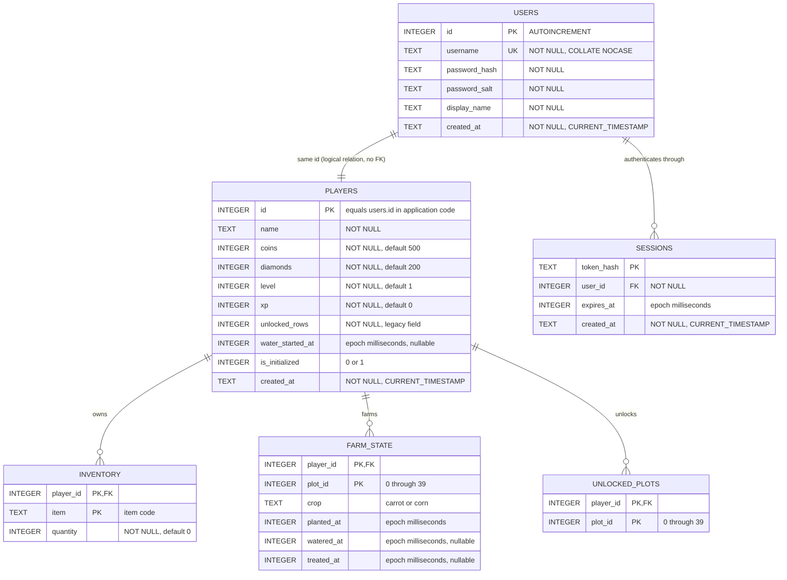

# Sunny Farm Database Model

Vietnamese version: [DATABASE_ERD_VI.md](./DATABASE_ERD_VI.md)

## Actual constraints

- `sessions.user_id → users.id`: declared foreign key with `ON DELETE CASCADE`.
- `inventory.player_id → players.id`: declared foreign key with composite primary key `(player_id, item)`.
- `farm_state.player_id → players.id`: declared foreign key with composite primary key `(player_id, plot_id)`.
- `unlocked_plots.player_id → players.id`: declared foreign key with composite primary key `(player_id, plot_id)`.
- `players.id = users.id`: the application creates both records with the same ID, but the schema does not currently declare this foreign key.

## Main domain values

- `inventory.item`: `carrot_seed`, `corn_seed`, `pesticide`, `water`, `carrot`, and `corn`.
- `farm_state` stores at most one growing crop per plot. Its row is deleted after harvesting.
- `unlocked_plots` stores the plots each player has unlocked.
- Gameplay timestamps use Unix epoch milliseconds; `created_at` uses SQLite timestamp text.
- `PRAGMA user_version = 1` marks the plot-grid migration from five columns to eight columns.

## Data outside the database

Online lobby and battle state are held in `Map` objects in `backend/realtime.js`. Restarting the server removes all rooms, ready states, and active battle progress.
