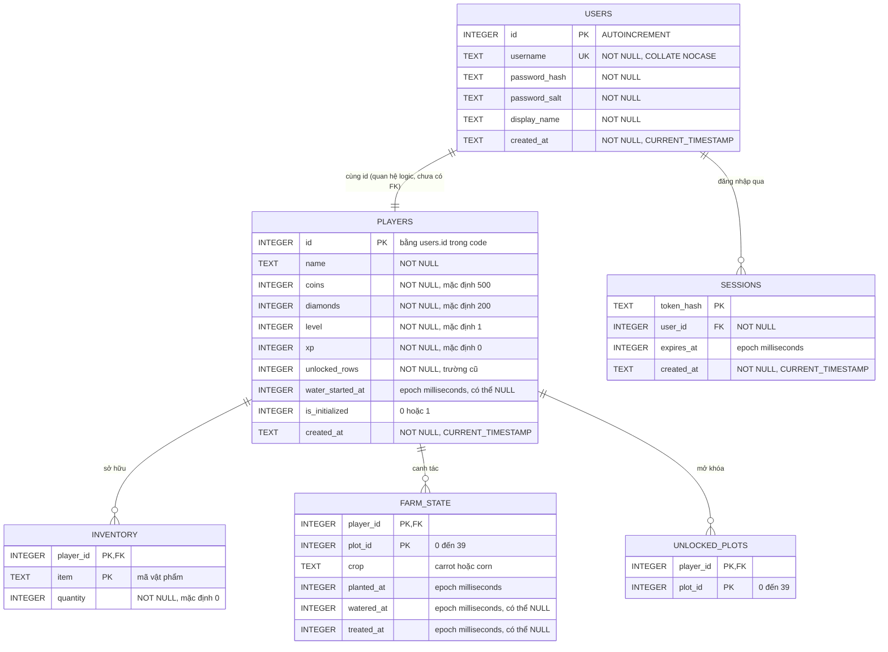

# Mô hình cơ sở dữ liệu Sunny Farm (Tiếng Việt)

English version: [DATABASE_ERD.md](./DATABASE_ERD.md)

## Ràng buộc thực tế

- `sessions.user_id → users.id`: foreign key thật, `ON DELETE CASCADE`.
- `inventory.player_id → players.id`: foreign key thật, khóa chính ghép `(player_id, item)`.
- `farm_state.player_id → players.id`: foreign key thật, khóa chính ghép `(player_id, plot_id)`.
- `unlocked_plots.player_id → players.id`: foreign key thật, khóa chính ghép `(player_id, plot_id)`.
- `players.id = users.id`: ứng dụng luôn tạo hai bản ghi cùng ID, nhưng schema hiện chưa khai báo foreign key.

## Giá trị nghiệp vụ chính

- `inventory.item`: `carrot_seed`, `corn_seed`, `pesticide`, `water`, `carrot`, `corn`.
- `farm_state` lưu một cây đang trồng trên mỗi ô đất; thu hoạch xong thì bản ghi bị xóa.
- `unlocked_plots` lưu riêng danh sách ô đất người chơi đã mở.
- Các trường thời gian gameplay dùng Unix epoch theo milliseconds; `created_at` dùng chuỗi thời gian của SQLite.
- `PRAGMA user_version = 1` đánh dấu migration lưới đất cũ từ 5 cột sang 8 cột.

## Dữ liệu không nằm trong database

Phòng chờ và trạng thái Online Battle hiện được giữ trong các `Map` tại `backend/realtime.js`. Khi server khởi động lại, toàn bộ phòng, trạng thái sẵn sàng và tiến độ trận đấu sẽ mất.
