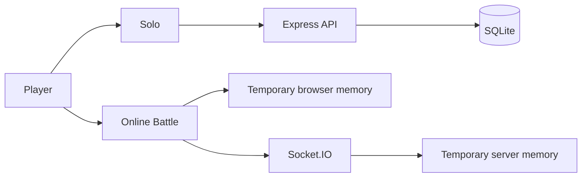

# How Online Battle Data Differs from Solo Data

Database model: [DATABASE_ERD.md](./DATABASE_ERD.md)

Vietnamese version: [ONLINE_VS_SOLO_VI.md](./ONLINE_VS_SOLO_VI.md)

## Overview



| Topic | Solo | Online Battle |
|---|---|---|
| Primary storage | SQLite | Browser memory and server-side `Map` objects |
| Persists after page reload | Yes | Not guaranteed |
| Persists after server restart | Yes | No |
| Inventory | Persistent rows in `inventory` | Separate temporary battle inventory |
| Initial carrot seeds | 5 when creating a New Game | 3 for each battle |
| Initial land | 8 plots; expandable to 40 | 8 temporary plots |
| Coins, diamonds, level, and XP | Read and updated | Unchanged |
| Shop and produce sales | Update the database | Outside battle progression |
| Win condition | No opponent | First player to harvest 3 carrots |

## Solo data

Solo gameplay uses HTTP APIs and these tables:

- `players`: name, coins, diamonds, level, XP, and water collection progress.
- `inventory`: seeds, water, pesticide, and harvested produce.
- `farm_state`: growing crops with planting, watering, and pesticide timestamps.
- `unlocked_plots`: purchased plots.

The Solo carrot lifecycle is:

```text
Plant → wait 10 seconds → water → wait 10 seconds
      → apply pesticide → wait 10 seconds → harvest
```

The server validates each important action and writes it to SQLite. Harvesting updates inventory, XP, and level.

## Online Battle data

Each client creates a temporary farm when a battle starts:

- Temporary level 1.
- 3 carrot seeds.
- 0 water.
- 8 unlocked plots.
- No Solo `farm_state` or `inventory` data is loaded from SQLite.

The Online Battle carrot lifecycle is:

```text
Plant → wait 10 seconds → collect and use water
      → wait 10 seconds → harvest
```

Collected water and remaining seeds exist only in client memory. They neither add to nor consume the Solo inventory.

The Socket.IO server stores this temporary data for each room:

- Players and the current host.
- Ready players.
- Room phase: `lobby`, `battle`, or `results`.
- Planted, harvested, and previously used plots for each player.
- Progress from 0 to 3 and the winner.

The server broadcasts `online:battle-state` to synchronize the progress display. Results remain visible for five seconds before the room returns to the lobby.

## When is data lost?

- Reloading or closing a tab can remove that client's temporary farm state.
- Restarting the server removes every Online Battle room and all active progress.
- Solo data in SQLite is unaffected by starting or finishing an online battle.

## Technical note

The server currently validates planting and harvesting events for scoring, while crop timing, water, and most of the battle crop lifecycle are managed by the client. For stronger anti-cheat protection, crop state and action timing should be moved to server-side authority.
