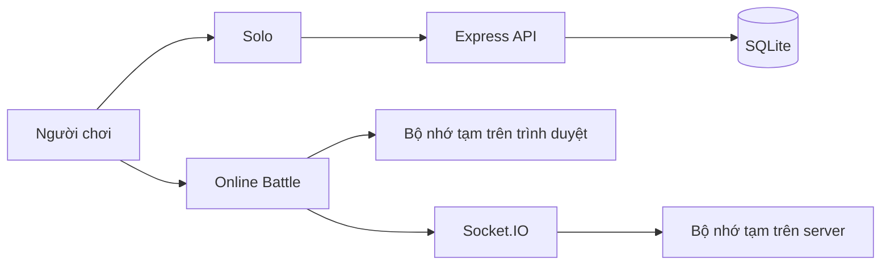

# Dữ liệu Online Battle và Solo khác nhau thế nào?

Mô hình database: [DATABASE_ERD_VI.md](./DATABASE_ERD_VI.md)

English version: [ONLINE_VS_SOLO.md](./ONLINE_VS_SOLO.md)

## Tổng quan



| Nội dung | Chơi Solo | Online Battle |
|---|---|---|
| Nơi lưu chính | SQLite | Bộ nhớ trình duyệt và `Map` trên server |
| Có lưu sau khi tải lại trang | Có | Không bảo đảm |
| Có lưu sau khi restart server | Có | Không |
| Kho đồ | Kho thật trong bảng `inventory` | Kho tạm riêng của trận |
| Hạt cà rốt ban đầu | 5 hạt khi tạo New Game | 3 hạt mỗi trận |
| Đất ban đầu | 8 ô; có thể mở đến 40 ô | 8 ô tạm |
| Tiền, kim cương, cấp độ, XP | Được đọc và cập nhật | Không thay đổi |
| Cửa hàng và bán nông sản | Có tác động vào database | Không thuộc tiến trình trận |
| Điều kiện thắng | Không có đối thủ | Người đầu tiên thu hoạch 3 carrot |

## Dữ liệu Solo

Solo sử dụng API HTTP và các bảng:

- `players`: tên, xu, kim cương, cấp độ, XP và tiến trình lấy nước.
- `inventory`: hạt giống, nước, thuốc trừ sâu và nông sản.
- `farm_state`: cây đang trồng cùng thời điểm trồng, tưới và phun thuốc.
- `unlocked_plots`: các ô đất đã mua.

Vòng đời carrot trong Solo:

```text
Trồng → chờ 10 giây → tưới nước → chờ 10 giây
      → dùng thuốc trừ sâu → chờ 10 giây → thu hoạch
```

Mỗi hành động quan trọng được server kiểm tra và ghi vào SQLite. Thu hoạch cập nhật kho đồ, XP và cấp độ.

## Dữ liệu Online Battle

Mỗi client tạo một nông trại tạm khi trận bắt đầu:

- Cấp độ tạm: 1.
- 3 hạt cà rốt.
- 0 nước.
- 8 ô đất mở sẵn.
- Không tải `farm_state` hoặc `inventory` Solo từ database.

Vòng đời carrot trong Online Battle:

```text
Trồng → chờ 10 giây → lấy và tưới nước
      → chờ 10 giây → thu hoạch
```

Nước lấy từ giếng và số hạt còn lại chỉ tồn tại trong bộ nhớ của client. Chúng không cộng vào hoặc trừ khỏi kho Solo.

Server Socket.IO giữ các dữ liệu tạm sau cho từng phòng:

- Danh sách người chơi và chủ phòng.
- Người chơi đã sẵn sàng.
- Giai đoạn phòng: `lobby`, `battle` hoặc `results`.
- Các ô từng trồng, đã thu hoạch và đã sử dụng của từng người.
- Tiến độ từ 0 đến 3 và người chiến thắng.

Server phát `online:battle-state` để đồng bộ bảng tiến độ. Kết quả hiện trong 5 giây, sau đó phòng trở về lobby.

## Khi nào dữ liệu bị mất?

- Reload hoặc đóng tab có thể làm mất nông trại tạm của client.
- Restart server làm mất toàn bộ phòng Online Battle và tiến độ đang chạy.
- Dữ liệu Solo trong SQLite không bị ảnh hưởng bởi việc bắt đầu hoặc kết thúc trận online.

## Lưu ý kỹ thuật

Server hiện xác nhận sự kiện trồng và thu hoạch để tính điểm, còn thời gian lớn lên, nước và vòng đời cây trong battle chủ yếu do client quản lý. Nếu cần chống gian lận tốt hơn, trạng thái cây và thời gian hành động nên được chuyển sang quản lý phía server.
