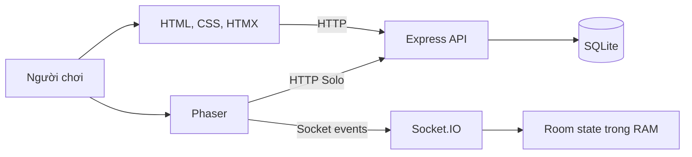

# Sunny Farm — Nội dung thuyết trình đầy đủ

English version: [PRESENTATION_EN.md](./PRESENTATION_EN.md)

## 1. Giới thiệu dự án

**Sunny Farm** là game nông trại nhiều người chơi chạy trên trình duyệt. Người chơi điều khiển nhân vật trong một bản đồ top-down, trồng và chăm sóc cây, quản lý tài nguyên, phát triển trang trại hoặc tham gia trận đấu online.

Dự án tập trung vào ba mục tiêu:

- Tạo vòng lặp gameplay nông trại đơn giản, dễ hiểu.
- Lưu tiến trình Solo an toàn trên server.
- Kết hợp gameplay nông trại với một chế độ đua realtime ngắn và dễ tham gia.

Phiên bản hiện tại đã có tài khoản riêng cho từng người chơi, gameplay Solo lưu bằng SQLite và Online Battle hoạt động qua Socket.IO.

## 2. Trải nghiệm người chơi

### Điều khiển

- Di chuyển bằng `WASD`, phím mũi tên hoặc chuột phải.
- Chạm mặt đất để di chuyển trên thiết bị cảm ứng.
- Nhấp chuột trái hoặc chạm ô đất, cây và giếng để tương tác.
- Camera tự động theo nhân vật và giao diện thích ứng với kích thước màn hình.

### Luồng bắt đầu

1. Đăng ký hoặc đăng nhập.
2. Chọn **Chơi tiếp**, **Chơi lại** hoặc **Đấu online**.
3. Khi tạo New Game, người chơi đặt tên nhân vật và nhận tài nguyên khởi đầu.
4. Popup và menu khóa input của game để tránh thao tác xuyên xuống cánh đồng.

## 3. Chế độ Solo

New Game bắt đầu với:

- 500 xu và 200 kim cương.
- Cấp 1, 0 XP.
- 5 hạt cà rốt.
- 8 ô đất đã mở trong tổng số 40 ô.

Vòng đời cây trong Solo:

```text
Trồng → chờ 10 giây → tưới nước → chờ 10 giây
      → dùng thuốc trừ sâu → chờ 10 giây → thu hoạch
```

Nước được lấy tại giếng sau thời gian chờ 10 giây. Thu hoạch đem nông sản vào kho, cộng 10 XP và có thể tăng cấp. Người chơi có thể:

- Trồng cà rốt và bắp.
- Mua hạt giống hoặc thuốc trừ sâu trong cửa hàng.
- Bán cà rốt và bắp để nhận xu.
- Dùng 50 kim cương để mở thêm một ô đất.
- Theo dõi kho đồ, tài nguyên, nhiệm vụ, sự kiện và bản đồ.

Mọi hành động quan trọng như mua hàng, trồng, tưới, phun thuốc, thu hoạch và mở đất đều được backend kiểm tra trước khi ghi vào database.

## 4. Chế độ Online Battle

Online Battle hỗ trợ:

- Phòng công khai để vào nhanh.
- Phòng riêng yêu cầu mã sáu ký tự.
- Tối đa 8 người chơi trong một phòng.
- Danh sách người chơi và trạng thái sẵn sàng realtime.
- Chỉ chủ phòng được bắt đầu khi có ít nhất 2 người và tất cả đã sẵn sàng.
- Tự chuyển quyền chủ phòng khi chủ cũ rời đi.
- Có xử lý kết nối lại ở phía client khi mạng gián đoạn ngắn.

Khi trận bắt đầu, mỗi người nhận một nông trại tạm riêng:

- 3 hạt cà rốt, 0 nước và 8 ô đất.
- Không sử dụng hoặc thay đổi kho đồ Solo.
- Trồng, chờ cây lớn, lấy nước, tưới và thu hoạch.
- Người đầu tiên thu hoạch đủ 3 cà rốt chiến thắng.

Tiến độ của mọi người được đồng bộ realtime. Kết quả hiển thị trong 5 giây trước khi phòng trở về lobby.

## 5. Solo và Online khác nhau thế nào?

| Nội dung | Solo | Online Battle |
|---|---|---|
| Mục tiêu | Phát triển trang trại | Thu hoạch 3 cà rốt nhanh nhất |
| Dữ liệu | Lưu bền trong SQLite | Tạm thời trên client và server |
| Kho đồ | Kho riêng của tài khoản | Kho riêng của từng trận |
| Cây trồng | Cà rốt và bắp | Cà rốt |
| Thuốc trừ sâu | Bắt buộc trong vòng đời cây | Không sử dụng |
| Tiền, XP, cấp độ | Có cập nhật | Không thay đổi |
| Sau khi restart server | Dữ liệu còn nguyên | Phòng và trận bị xóa |

Chi tiết: [ONLINE_VS_SOLO_VI.md](./ONLINE_VS_SOLO_VI.md).

## 6. Công nghệ sử dụng

| Thành phần | Công nghệ | Vai trò |
|---|---|---|
| Game engine | Phaser 3 | Bản đồ, nhân vật, camera, vật lý và tương tác |
| Giao diện | HTML + CSS | Menu, HUD, popup và responsive |
| UI động | HTMX | Cửa hàng, kho đồ, HUD và các panel |
| Backend | Node.js + Express 5 | API, xác thực và phục vụ static files |
| Realtime | Socket.IO | Phòng chờ, trạng thái trận và tiến độ |
| Database | SQLite | Tài khoản và tiến trình Solo |
| Đa ngôn ngữ | JSON locale | Tiếng Việt và tiếng Anh |

## 7. Kiến trúc hệ thống



- **Solo:** client gửi HTTP request; server xác thực, kiểm tra luật chơi và giao dịch với SQLite.
- **Online:** client giữ nông trại tạm; Socket.IO giữ phòng, người chơi, ô đã dùng, tiến độ và người thắng.
- **Frontend:** Phaser xử lý thế giới game, còn HTML/HTMX xử lý menu và các panel.

## 8. Mô hình dữ liệu

Database có sáu bảng:

| Bảng | Mục đích |
|---|---|
| `users` | Tài khoản, tên hiển thị và thông tin mật khẩu đã băm |
| `players` | Xu, kim cương, cấp độ, XP và trạng thái người chơi |
| `sessions` | Phiên đăng nhập có thời hạn |
| `inventory` | Vật phẩm và số lượng theo người chơi |
| `farm_state` | Cây đang trồng trên từng ô đất |
| `unlocked_plots` | Các ô đất đã mở |

Sơ đồ đầy đủ: [DATABASE_ERD_VI.md](./DATABASE_ERD_VI.md).

## 9. Xác thực và bảo vệ dữ liệu

- Mật khẩu được băm bằng `scrypt` với salt riêng.
- Token phiên được băm trước khi lưu trong database.
- Cookie đăng nhập dùng `HttpOnly` và `SameSite=Strict`.
- API game và cửa hàng yêu cầu đăng nhập.
- Giao dịch nhiều bước dùng transaction và rollback khi có lỗi.
- Backend kiểm tra tài nguyên, cấp độ, thời gian phát triển và quyền sở hữu ô đất.
- Truy vấn gameplay lấy `player_id` từ context xác thực thay vì tin dữ liệu client gửi lên.

## 10. Cấu trúc dự án

```text
backend/
  server.js          Khởi tạo Express, SQLite và Socket.IO
  realtime.js        Phòng và trận Online Battle
  i18n.js            Dịch thông báo phía server
  routes/            Auth, game, shop và transaction

public/
  index.html         Giao diện và luồng điều hướng
  styles.css         Responsive UI
  game/              Scene và system của Phaser
  locales/           Tiếng Việt và tiếng Anh
  assets/            Hình ảnh và sprite

docs/                ERD, so sánh dữ liệu và presentation
database.sqlite      Dữ liệu Solo
```

## 11. Kịch bản demo đề xuất

1. Đăng ký tài khoản và tạo New Game.
2. Giới thiệu HUD, nhân vật và thao tác di chuyển.
3. Trồng cà rốt, lấy nước từ giếng và hoàn thành vòng đời cây.
4. Mở cửa hàng để mua vật phẩm, sau đó xem kho đồ.
5. Thu hoạch, bán nông sản và quan sát XP thay đổi.
6. Mở một ô đất khóa để minh họa giao dịch bằng kim cương.
7. Reload trang để chứng minh dữ liệu Solo được lưu.
8. Mở hai trình duyệt hoặc hai tài khoản, tạo và tham gia phòng Online.
9. Cho cả hai người sẵn sàng, bắt đầu trận và quan sát tiến độ realtime.
10. Thu hoạch đủ 3 cà rốt để hiển thị người thắng và tự trở về lobby.

## 12. Điểm mạnh hiện tại

- Có vòng lặp gameplay hoàn chỉnh thay vì chỉ là giao diện mẫu.
- Tài khoản và tiến trình Solo tách biệt cho từng người.
- Server kiểm soát dữ liệu kinh tế và trạng thái Solo.
- Online Battle có lobby, ready state, gameplay, kết quả và reset phòng.
- Giao diện responsive, hỗ trợ chuột, bàn phím và cảm ứng.
- Hai ngôn ngữ và tài liệu kỹ thuật song ngữ.
- Code được chia rõ giữa `backend`, `public` và `docs`.

## 13. Hạn chế hiện tại

- Phòng và tiến độ Online Battle chỉ nằm trong RAM, nên mất khi server restart.
- Thời gian phát triển cây và nước trong battle chủ yếu do client quản lý; khả năng chống gian lận còn hạn chế.
- Chưa có matchmaking tự động, bảng xếp hạng hoặc lịch sử trận.
- Nhiệm vụ, sự kiện và bản đồ hiện còn ở mức cơ bản.
- Nội dung cây trồng, vật phẩm, âm thanh và hiệu ứng còn ít.
- Chưa có bộ kiểm thử tự động cho API và gameplay realtime.

## 14. Hướng phát triển

Ưu tiên đề xuất:

1. Chuyển trạng thái và thời gian Online Battle sang server-authoritative.
2. Lưu trận đấu, kết quả và lịch sử người chơi trong database.
3. Thêm matchmaking, bảng xếp hạng và phòng tùy chỉnh.
4. Mở rộng nhiệm vụ realtime, cây trồng, vật phẩm và bản đồ.
5. Bổ sung hướng dẫn người mới, âm thanh và hiệu ứng.
6. Viết test cho API, database transaction và Socket.IO.

## 15. Kết luận

Sunny Farm hiện là một game web có thể chơi được với hai trải nghiệm rõ ràng: xây dựng trang trại lâu dài trong Solo và đua thu hoạch ngắn trong Online Battle. Dự án đã kết nối gameplay, tài khoản, database và realtime trong một kiến trúc đủ gọn để trình bày, đồng thời vẫn có lộ trình rõ ràng để mở rộng.

> **Thông điệp chính:** Sunny Farm biến vòng lặp nông trại quen thuộc thành một trải nghiệm web có dữ liệu lưu bền và thi đấu realtime.
