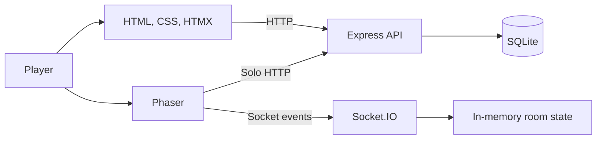

# Sunny Farm — Complete Presentation

Vietnamese version: [PRESENTATION.md](./PRESENTATION.md)

## 1. Project introduction

**Sunny Farm** is a multiplayer farming game that runs in a web browser. Players control a character in a top-down world, grow crops, manage resources, expand a persistent farm, or join short online races.

The project has three goals:

- Provide a simple and approachable farming gameplay loop.
- Persist Solo progress securely on the server.
- Combine farming mechanics with a short real-time competitive mode.

The current version includes individual accounts, SQLite-backed Solo gameplay, and a working Online Battle mode powered by Socket.IO.

## 2. Player experience

### Controls

- Move with `WASD`, the arrow keys, or the right mouse button.
- Tap the ground to move on touch devices.
- Left-click or tap plots, crops, and the well to interact.
- The camera follows the character and the interface adapts to the screen size.

### Entry flow

1. Register or log in.
2. Choose **Continue**, **Restart**, or **Online Battle**.
3. When creating a New Game, choose a character name and receive starter resources.
4. Menus and popups lock game input to prevent clicks from passing through to the farm.

## 3. Solo mode

A New Game starts with:

- 500 coins and 200 diamonds.
- Level 1 and 0 XP.
- 5 carrot seeds.
- 8 unlocked plots out of 40 total plots.

The Solo crop lifecycle is:

```text
Plant → wait 10 seconds → water → wait 10 seconds
      → apply pesticide → wait 10 seconds → harvest
```

Collecting water from the well takes 10 seconds. A harvest adds produce to inventory, grants 10 XP, and may increase the player's level. Players can:

- Grow carrots and corn.
- Buy seeds and pesticide from the shop.
- Sell carrots and corn for coins.
- Spend 50 diamonds to unlock another plot.
- View inventory, resources, quests, events, and the map.

The backend validates important actions such as purchases, planting, watering, pesticide use, harvesting, and land unlocking before writing them to the database.

## 4. Online Battle mode

Online Battle supports:

- Public rooms with quick join.
- Private rooms protected by a six-character code.
- Up to 8 players per room.
- Real-time player and ready-state updates.
- Host-only start after at least 2 players are present and everyone is ready.
- Automatic host transfer when the current host leaves.
- Client-side reconnection handling after short network interruptions.

At battle start, each player receives a separate temporary farm:

- 3 carrot seeds, 0 water, and 8 plots.
- Solo inventory is neither loaded nor modified.
- Plant, wait, collect water, water crops, and harvest.
- The first player to harvest 3 carrots wins.

Everyone's progress is synchronized in real time. The result remains visible for five seconds before the room returns to the lobby.

## 5. Solo and Online comparison

| Topic | Solo | Online Battle |
|---|---|---|
| Goal | Develop a persistent farm | Harvest 3 carrots first |
| Data | Persisted in SQLite | Temporary client and server memory |
| Inventory | Account inventory | Separate inventory for each battle |
| Crops | Carrot and corn | Carrot |
| Pesticide | Required in the crop lifecycle | Not used |
| Coins, XP, and level | Updated | Unchanged |
| After server restart | Data remains | Rooms and battles are removed |

See [ONLINE_VS_SOLO.md](./ONLINE_VS_SOLO.md) for details.

## 6. Technology stack

| Component | Technology | Responsibility |
|---|---|---|
| Game engine | Phaser 3 | World, character, camera, physics, and interaction |
| Interface | HTML + CSS | Menus, HUD, popups, and responsive layout |
| Dynamic UI | HTMX | Shop, inventory, HUD, and panels |
| Backend | Node.js + Express 5 | APIs, authentication, and static hosting |
| Real time | Socket.IO | Lobby, battle state, and progress |
| Database | SQLite | Accounts and persistent Solo progress |
| Localization | JSON locale files | Vietnamese and English |

## 7. System architecture



- **Solo:** the client sends HTTP requests; the server authenticates the user, validates game rules, and transacts with SQLite.
- **Online:** the client owns its temporary farm; Socket.IO tracks rooms, players, used plots, progress, and the winner.
- **Frontend:** Phaser handles the game world while HTML and HTMX handle navigation and information panels.

## 8. Data model

The database contains six tables:

| Table | Purpose |
|---|---|
| `users` | Account, display name, and password hash data |
| `players` | Coins, diamonds, level, XP, and player state |
| `sessions` | Expiring login sessions |
| `inventory` | Item quantities per player |
| `farm_state` | The crop currently growing on each plot |
| `unlocked_plots` | Unlocked land for each player |

See [DATABASE_ERD.md](./DATABASE_ERD.md) for the complete diagram.

## 9. Authentication and data protection

- Passwords are hashed with `scrypt` and an individual salt.
- Session tokens are hashed before database storage.
- Login cookies use `HttpOnly` and `SameSite=Strict`.
- Game and shop APIs require authentication.
- Multi-step writes use transactions with rollback on failure.
- The backend checks resources, level requirements, growth times, and plot ownership.
- Gameplay queries obtain `player_id` from authenticated request context rather than trusting client input.

## 10. Project structure

```text
backend/
  server.js          Express, SQLite, and Socket.IO initialization
  realtime.js        Online Battle rooms and matches
  i18n.js            Server-side translations
  routes/            Authentication, game, shop, and transactions

public/
  index.html         Interface and navigation flow
  styles.css         Responsive UI
  game/              Phaser scenes and systems
  locales/           Vietnamese and English
  assets/            Images and sprites

docs/                ERD, data comparison, and presentations
database.sqlite      Persistent Solo data
```

## 11. Suggested demo flow

1. Register an account and create a New Game.
2. Introduce the HUD, character, and movement controls.
3. Plant a carrot, collect water, and complete its crop lifecycle.
4. Open the shop, buy an item, and inspect the inventory.
5. Harvest and sell produce, then show the XP change.
6. Unlock a plot to demonstrate the diamond transaction.
7. Reload the page to prove that Solo data persists.
8. Open two browsers or accounts, then create and join an Online room.
9. Ready both players, start the match, and observe real-time progress.
10. Harvest 3 carrots to show the winner and automatic lobby return.

## 12. Current strengths

- A complete gameplay loop rather than a static interface prototype.
- Separate accounts and persistent Solo progress for each player.
- Server-controlled Solo economy and farm state.
- Online Battle with lobby, ready state, gameplay, results, and room reset.
- Responsive mouse, keyboard, and touch controls.
- Two interface languages and bilingual technical documentation.
- Clear separation between `backend`, `public`, and `docs`.

## 13. Current limitations

- Online rooms and progress exist only in memory and disappear after a server restart.
- Battle crop timing and water are mainly client-managed, limiting anti-cheat protection.
- There is no automatic matchmaking, leaderboard, or match history.
- Quests, events, and the map remain basic.
- Crop, item, audio, and visual-effect content is limited.
- Automated API and real-time gameplay tests are not yet available.

## 14. Future development

Recommended priorities:

1. Move Online Battle state and timing to server authority.
2. Store matches, results, and player history in the database.
3. Add matchmaking, leaderboards, and custom room settings.
4. Expand real-time quests, crops, items, and maps.
5. Add onboarding, audio, and more visual feedback.
6. Add tests for APIs, database transactions, and Socket.IO.

## 15. Conclusion

Sunny Farm is now a playable web game with two distinct experiences: long-term farm development in Solo and short harvesting races in Online Battle. It connects gameplay, accounts, persistent storage, and real-time communication in a structure that is easy to demonstrate and ready for further development.

> **Main message:** Sunny Farm turns a familiar farming loop into a browser experience with persistent progression and real-time competition.
